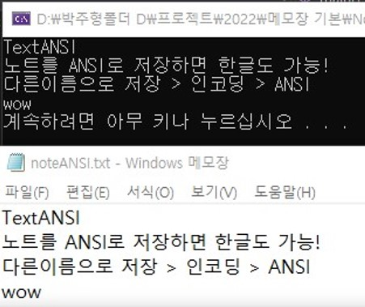
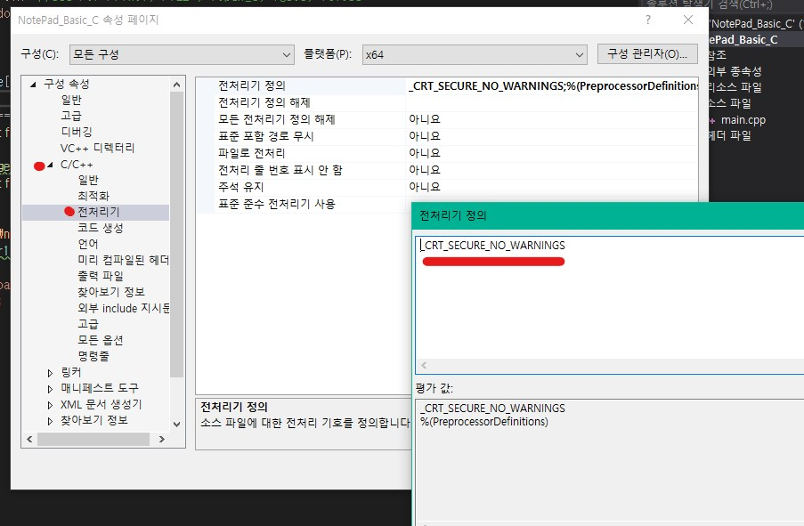

# Notepad 메모장
<p align="center"></p>
 txt 메모장을 한줄 씩 받아오는 코드입니다.

## Use fopen_s

``` go
		char line[255];
		FILE* fr1 = fopen("noteANSI.txt", "r");
		if (fr1 == NULL)
			printf("Failed Loaded noteANSI.txt\n");

		while (fgets(line, sizeof(line), fr1) != NULL) {
			printf("%s", line);
			
		fclose(fr1);
```

### Input
 문자로 이루어진 파일 위치정보
 
``` go
"File dir"
```

### Output
 한줄한줄 받아온다
 
 ``` go
char line[255];
```
 
### Result
<p align="center"></p>

## Use fopen

``` go
		char line[255];
		FILE* fr1 = fopen("noteANSI.txt", "r");
		if (fr1 == NULL)
			printf("Failed Loaded noteANSI.txt\n");

		while (fgets(line, sizeof(line), fr1) != NULL) {
			printf("%s", line);
			
		fclose(fr1);
```

fopen을 사용하기 위해서 아래 3가지 중 하나의 방법을 활용한다.
 #### 방법.1
 
<p align="center"></p>

 프로젝트 속성 > C/C++ > 전처리기 > 전처리기 정의 > _CRT_SECURE_NO_WARNINGS
 
 #### 방법.2
 #define _CRT_SECURE_NO_WARNINGS
 
 #### 방법.3
 #pragma warning(disable:4996)
 
### Input
 문자로 이루어진 파일 위치정보
 
 ``` go
"File dir"
```

### Output
 한줄한줄 받아온다
 
``` go
char line[255];
```

### Result
<p align="center"></p>
